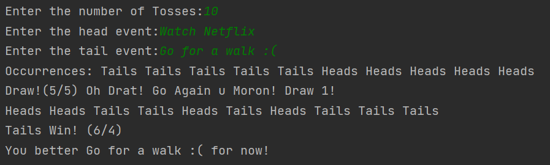
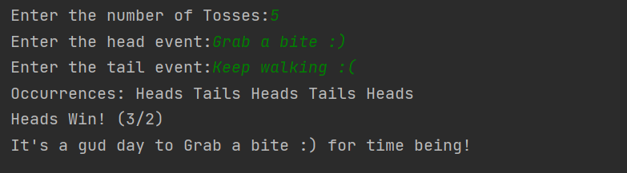
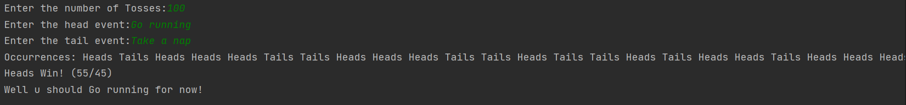

## Toss God -  Toss Your Ambiguities!🎈
Lurking between choices?🤔 Don't have a coin to toss? 😱 _Well Not Again!_

_A Python program that can help you choose between 2 events in a fun way!_

## Features ⚡

* Can perform _n_ tosses at the same time😉!
* Outputs the outcome of each toss.
* Redraws automatically if the resultant outcome was a Draw! _No more Draws in choices_! 🤞
* Takes the choices to be performed by the user on **Success** and outputs a dynamic message for the same! 😎

## Snaps📷

  
_Outcome with Draw!_    

  
_Outcome with 5 trials_

  
_Outcome with 100 trials_

## Requirements 🛠

The programs runs entirely on Python 3 ❤. No extra dependencies !

_Uses built-in Python3 random module_  
_Runtime tested in Python 3.9.1_

## Connect with Me 📱
[Linked In](https://www.linkedin.com/in/neeraj-s-kumar-938161129)  

_Other Projects:_  
[Music Recording Company System In Java](https://github.com/neerajsk911/MusicRecordingCompany)
